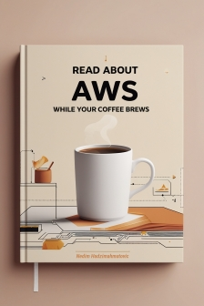
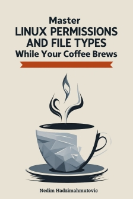

- 👋 Hi, I’m @neidiom
- 👀 I’m interested in anything ending in Nix.
- 🌱 I’m currently learning Omakub.
- 💞️ I’m looking to collaborate on ...
- 📫 How to reach me ...

## Publications
#### Read About AWS While Your Coffee Brews
A compilation of my AWS-related blog articles compiled into an e-book can be downloaded for free. 
* 
      
#### Master Linux Permissions and File Types While Your Coffee Brews
This book covers the basics of Linux security such as file types, file ownership, and file permissions.
* 

<!---
neidiom/neidiom is a ✨ special ✨ repository because its `README.md` (this file) appears on your GitHub profile.
You can click the Preview link to take a look at your changes.
--->
